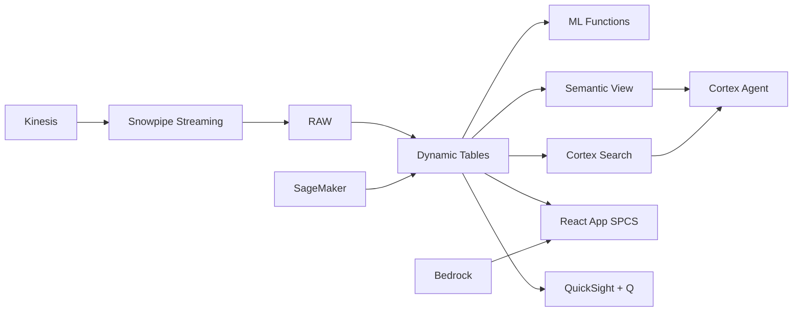

# BPO Workforce Analytics & Attrition Prediction

Philippines is the world's BPO capital with 1.7M agents — Snowflake ML predicts attrition 60 days out, classifies flight-risk agents, surfaces top drivers, and alerts HR before critical talent walks.

## Architecture

The Philippines is the world's BPO capital — $32.5 billion in revenue, 1.7 million workers. But the industry hemorrhages talent at 30-40% annually. One major BPO company with 28,000 agents across 45 sites is losing ₱420M per year to attrition. Traditional HRIS reports detect trends too late — by the time HR notices, the agent's already signed with a competitor down the road in BGC.



## Snowflake Capabilities

| Capability | Implementation |
|-----------|---------------|
| Dynamic Tables | SITE_ATTRITION_SUMMARY / AGENT_RISK_PROFILE / ATTRITION_TIMESERIES / TRAINING_EFFECTIVENESS |
| ML Functions | ML.CLASSIFICATION + ML.TOP_INSIGHTS |
| Cortex AI | AI_CLASSIFY, COMPLETE |
| Cortex Search | 65000 documents indexed |
| Cortex Agent | WORKFORCE_INTELLIGENCE_AGENT |
| Semantic View | BPO_WORKFORCE_ANALYTICS |
| React App (SPCS) | 5 tabs + DemoGuide |


## AWS Services

| Service | Role in Demo |
|---------|-------------|
| Amazon Kinesis | Stream HRIS and attendance events in real-time |
| Amazon SageMaker | Train attrition prediction model |
| Amazon Bedrock (Claude) | Generate personalized retention recommendations |
| Amazon SES | Send attrition alert emails to HR business partners |
| Amazon QuickSight + Q | Workforce analytics dashboard with NL queries |
| AWS Glue | ETL for HRIS data transformation |


## Personas

| Persona | Role | Key Questions |
|---------|------|---------------|
| **Maria Cristina Santos-Reyes** | Chief People Officer | "Which sites have the highest attrition this quarter?" "What's our total cost of attrition in pesos?" |
| **James Benedict Tan** | Workforce Planning Manager | "What are the top 3 drivers of attrition in our Cebu site?" "Show me the tenure distribution for high-performers at risk." |


## Data

| Table | Rows | Description |
|-------|------|-------------|
| SITES | 45 | BPO delivery centers across Philippines (NCR, Cebu, Clark, Davao) |
| AGENTS | 28,000 | Active BPO agents with tenure, performance, compensation data |
| ATTENDANCE_LOGS | 850,000 | 90 days of attendance, tardiness, overtime records |
| PERFORMANCE_SCORES | 112,000 | Monthly KPI scores (CSAT, AHT, FCR, schedule adherence) |
| SEPARATIONS | 4,200 | 12 months of resignation and termination records |
| TRAINING_RECORDS | 65,000 | Certifications, upskilling programs, nesting completion |
| COMPENSATION_BENCHMARKS | 200 | Market salary data by role and location |
| LABOR_MARKET | 12 | Philippines BPO labor market indicators |


## Build Instructions

### Prerequisites
- Snowflake account with ACCOUNTADMIN access
- Cortex AI enabled (ML Functions, Search, Agent)
- Warehouse: BPO_WH (Medium)
- AWS CLI with access (us-west-2)

### Deployment

```bash
snowsql -f snowflake/00_setup.sql
snowsql -f snowflake/01_marketplace_install.sql
snowsql -f snowflake/02_raw_tables.sql
snowsql -f snowflake/03_staging.sql
snowsql -f snowflake/04_dynamic_tables.sql
snowsql -f snowflake/05_search.sql
snowsql -f snowflake/06_ml_models.sql
snowsql -f snowflake/07_semantic_view.sql
snowsql -f snowflake/08_agent.sql
```

### React App (SPCS)
```bash
cd app && npm ci && npm run build
docker build -t aws-philippines-bpo-workforce-app .
docker push bdiqc8sm-default.registry.snowflakecomputing.com/bpo_workforce/app/aws_philippines_bpo_workforce/app:latest
```

### Demo Mode
Open the app URL with `?demo=true` for presenter view.

## Build Modes

### Snowflake Only
Run scripts 00-08 (skip AWS-specific integration). Uses:
- **Snowpipe Streaming SDK** instead of Amazon Kinesis
- **ML.CLASSIFICATION (native)** instead of Amazon SageMaker
- **Cortex Complete** instead of Amazon Bedrock (Claude)
- **Alerts + Notification Integration (Email)** instead of Amazon SES
- **Snowflake Intelligence (Cortex Analyst)** instead of Amazon QuickSight + Q
- **Dynamic Tables (declarative pipelines)** instead of AWS Glue

### Full AWS + Snowflake
Run all scripts including AWS integration. Deploy QuickSight dashboard from `quicksight/`.

## Business Impact

Industry research and Snowflake customer outcomes:
- **Philippines BPO industry revenue reached $32.5B in 2023, employing 1.7M workers** — [IBPAP](https://ibpap.org/)
- **Average BPO attrition in Philippines is 30-40% annually — highest in APAC services** — [Everest Group](https://www.everestgrp.com/research/market-insights)
- **Cost of replacing a BPO agent is 50-200% of annual salary including training** — [SHRM](https://www.shrm.org/topics-tools/news/talent-acquisition/real-costs-recruitment)
- **AI-driven workforce analytics reduces attrition by 20-35% in contact centers** — [McKinsey Operations](https://www.mckinsey.com/capabilities/operations/our-insights)
- **Miro** (Snowflake customer): reduced mean time to resolution by 30% using AI-powered workforce analytics on Snowflake -- [snowflake.com/customers/miro](https://www.snowflake.com/en/customers/all-customers/case-study/miro/)

## Key Demo Numbers

- **₱420M** annual attrition cost across 45 BPO sites
- **3 of 45 sites** above 9% monthly attrition (CRITICAL)
- **1,247 agents** flagged as high flight risk (>0.75 score)
- **11.2%** monthly attrition at Cebu IT Park (highest)
- **34% lower attrition** for agents completing training programs
- **28,000 agents** scored weekly by ML.CLASSIFICATION


## License

Apache 2.0 — See [LICENSE](LICENSE) for details.

This is a personal demo project and is not an official Snowflake offering. It comes with no support or warranty.